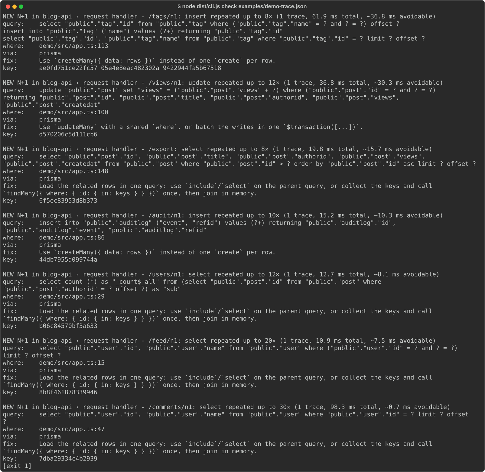
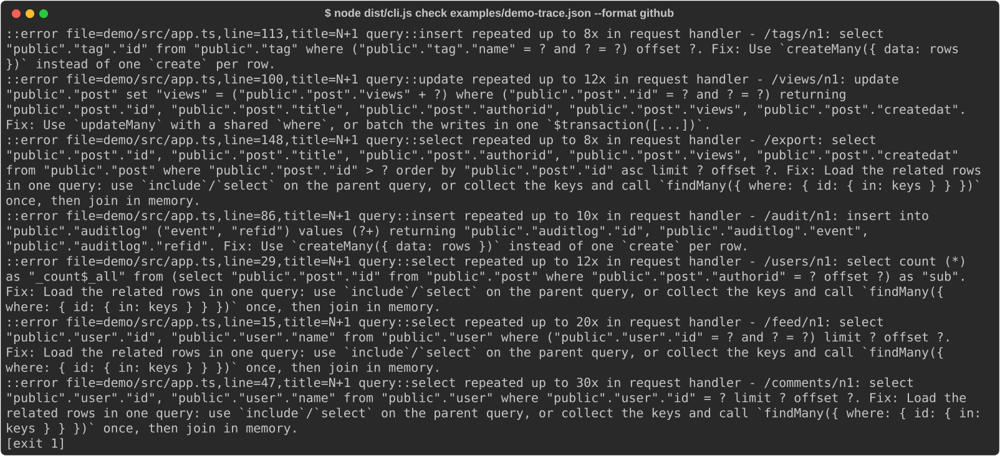

# n1-doctor

> **Credits.** Built by Amaan Mithani with Claude (Anthropic) as the AI coding assistant.

Finds N+1 queries in OpenTelemetry traces and fails CI when a new one appears.

Run your test suite or a smoke test with tracing on, export the spans as OTLP/JSON, and point `n1doctor` at the file. It groups database statements by their SQL fingerprint and by the application span that issued them (seeing through ORM wrapper spans such as Prisma's), and reports any statement repeated at least `--threshold` times under one parent. Each finding carries a source location when the parent span has `code.*` attributes (the demo sets them at the top of each handler with a small helper; stock HTTP instrumentations don't), the ORM, the time a batched query would save, and a fix specific to the ORM and statement kind.

<!-- sample:start -->

```
$ n1doctor check examples/demo-trace.json
NEW N+1 in blog-api › request handler - /tags/n1: insert repeated up to 8× (1 trace, 61.9 ms total, ~36.8 ms avoidable)
  query:    select "public"."tag"."id" from "public"."tag" where ("public"."tag"."name" = ? and ? = ?) offset ?
            insert into "public"."tag" ("name") values (?+) returning "public"."tag"."id"
            select "public"."tag"."id", "public"."tag"."name" from "public"."tag" where "public"."tag"."id" = ? limit ? offset ?
  where:    demo/src/app.ts:113
  via:      prisma
  fix:      Use `createMany({ data: rows })` instead of one `create` per row.
  key:      ae0fd751ce22fc57 05e4e8eac482302a 9422944fa5b67518
```

<!-- sample:end -->

## Screenshots



`node dist/cli.js check examples/demo-trace.json`, run locally on the demo trace committed in `examples/` (recorded from the Prisma demo app in `demo/`).



The same trace with `--format github`: the workflow-command lines GitHub turns into PR annotations.

## Usage

```sh
npm ci && npm run build
node dist/cli.js check traces/*.json                  # exit 1 if any N+1 is found
node dist/cli.js baseline traces/*.json --out n1-baseline.json
node dist/cli.js check traces/*.json --baseline n1-baseline.json   # only new ones fail
node dist/cli.js check traces/*.json --format github  # PR annotations
node dist/cli.js check traces/*.json --format json
```

Exit codes: 0 no new findings, 1 new findings, 2 bad input.

Trace files can be a single `ExportTraceServiceRequest` JSON document or JSON Lines of them, which is what the collector's `file` exporter writes. Both the current (`db.query.text`) and older (`db.statement`) semantic-convention attributes are read.

### GitHub Action

```yaml
- uses: amaanmithani/n1-doctor@main
  with:
    traces: otel/traces.jsonl
    baseline: n1-baseline.json # optional: accepted findings
    threshold: 5 # optional
```

New findings become error annotations (on the file and line from the span's `code.*` attributes, when present); baselined ones become warnings. `traces` is split on spaces so globs work; paths containing spaces aren't supported.

## How it decides

1. **Fingerprint** every statement: literals, bind parameters (`$1`, `:name`, `@p1`) and numbers become `?`, `IN (...)` and multi-row `VALUES` lists of any length collapse to one, comments and case go. It is a lexer, not a parser, so it never fails on an unfamiliar dialect.
2. **Find the logical parent**: walk up from the statement past ORM and driver spans (Prisma, pg, mysql, Sequelize, TypeORM, Knex, MikroORM, Drizzle, SQLAlchemy, Django) to the first application span.
3. **Count** each fingerprint per trace and parent. At or above the threshold is an N+1. Transaction control (`BEGIN`, `COMMIT`, `SAVEPOINT`, `SET`) and `SELECT 1` pings are ignored.
4. **Group** statements repeated the same number of times under the same parent into one finding, since they are one loop body (an upsert is a select followed by an insert).
5. **Key** each statement by service, parent name and fingerprint, so keys are stable across runs and a baseline still matches when a loop body issues a different mix of statements on different data (an upsert that inserts some rows and not others).
6. **Estimate savings** from wall time: the time the repeated statements covered, with overlapping concurrent queries counted once, minus the slowest one.

## Results

<!-- results:start -->

Ground truth: 18 routes of a Prisma 7 + Express 5 + PostgreSQL app (`demo/`), 7 with a real N+1 and 11 without. One request per route, traced with the stock OpenTelemetry HTTP/Express/Prisma instrumentations.

At the default threshold (5): **precision 86%, recall 86%** (6 caught, 1 false alarm, 1 missed). An N+1 counts as caught only if a finding on that route names the expected statement kind and table; any other finding is a false alarm.

| Route                   | Has N+1 | DB queries | Flagged               | What it is                                                             |
| ----------------------- | ------- | ---------- | --------------------- | ---------------------------------------------------------------------- |
| `GET /feed/n1`          | yes     | 21         | yes                   | author per post (findUnique in a loop)                                 |
| `GET /users/n1`         | yes     | 13         | yes                   | post count per user                                                    |
| `GET /comments/n1`      | yes     | 31         | yes                   | author per comment via Promise.all + findFirst (concurrent N+1)        |
| `POST /audit/n1`        | yes     | 10         | yes                   | insert per event                                                       |
| `POST /views/n1`        | yes     | 12         | yes                   | update per post                                                        |
| `POST /tags/n1`         | yes     | 32         | yes                   | upsert per new tag                                                     |
| `GET /feed/fixed`       | no      | 2          | no                    | include                                                                |
| `GET /users/fixed`      | no      | 2          | no                    | groupBy                                                                |
| `GET /comments/fixed`   | no      | 2          | no                    | DataLoader                                                             |
| `POST /audit/fixed`     | no      | 1          | no                    | createMany                                                             |
| `POST /views/fixed`     | no      | 1          | no                    | updateMany                                                             |
| `POST /tags/fixed`      | no      | 1          | no                    | createMany skipDuplicates                                              |
| `GET /dashboard`        | no      | 7          | no                    | look-alike: 7 different queries                                        |
| `GET /export`           | no      | 8          | **yes (false alarm)** | look-alike: keyset pagination, each page depends on the last           |
| `POST /publish`         | no      | 6          | no                    | look-alike: transaction of distinct statements                         |
| `GET /by-ids`           | no      | 1          | no                    | look-alike: one IN query                                               |
| `GET /comments/batched` | no      | 2          | no                    | look-alike: concurrent findUnique, which Prisma batches into one query |
| `GET /pinned`           | yes     | 3          | **no (missed)**       | real N+1 of only 3 iterations: below the default threshold             |

Threshold sweep (same traces):

| Threshold | Precision | Recall | Caught | False alarms | Missed |
| --------- | --------- | ------ | ------ | ------------ | ------ |
| 2         | 75%       | 86%    | 6      | 2            | 1      |
| 3         | 75%       | 86%    | 6      | 2            | 1      |
| 4         | 86%       | 86%    | 6      | 1            | 1      |
| 5         | 86%       | 86%    | 6      | 1            | 1      |
| 6         | 86%       | 86%    | 6      | 1            | 1      |
| 8         | 86%       | 86%    | 6      | 1            | 1      |
| 10        | 100%      | 71%    | 5      | 0            | 2      |
| 12        | 100%      | 57%    | 4      | 0            | 3      |
| 15        | 100%      | 29%    | 2      | 0            | 5      |

Latency of each N+1 route against its fix: 50 sequential requests per side after warm-up, Node v25.9.0, PostgreSQL (local, same host). Round trips here cost well under a millisecond; over a network they cost more, so these are lower bounds.

| Route          | Fix                       | Queries (N+1 → fixed) | p50 ms     | p95 ms     |
| -------------- | ------------------------- | --------------------- | ---------- | ---------- |
| `/feed/n1`     | include                   | 21 → 2                | 11.4 → 2.5 | 20.8 → 5.3 |
| `/users/n1`    | groupBy                   | 13 → 2                | 7.6 → 2.4  | 12.7 → 4.8 |
| `/comments/n1` | DataLoader                | 31 → 2                | 8.2 → 2.6  | 11.3 → 4.3 |
| `/audit/n1`    | createMany                | 10 → 1                | 6.7 → 2.7  | 12.6 → 4.4 |
| `/views/n1`    | updateMany                | 12 → 1                | 11.2 → 2.1 | 22.0 → 5.1 |
| `/tags/n1`     | createMany skipDuplicates | 32 → 1                | 11.5 → 1.9 | 18.1 → 2.5 |

<!-- results:end -->

Reproduce with a local PostgreSQL: `cd demo && npm ci && npx prisma db push && npx tsx src/eval.ts`, then `npm run build && node scripts/report.mjs`. CI reruns the evaluation against a fresh database on every push and fails if any route's verdict changes. The mutating routes are reset between requests where it matters (tags are deleted before each upsert request, so upserts insert).

## Limits

- **Sequential dependencies look like N+1s.** Keyset pagination (`/export`) repeats one query whose input is the previous page's last id. It cannot be batched, but from the trace alone it looks the same as a loop that can. Accept it in the baseline.
- **Below-threshold loops are missed by design.** Three lookups in a loop (`/pinned`) are a real N+1 but not flagged at the default threshold of 5; a threshold of 3 catches it without new false alarms on this app (see the sweep). Loops whose size depends on data may only cross the threshold in production.
- **Batching the ORM does for you is invisible, correctly.** Prisma merges `findUnique` calls made in the same tick into one query (`/comments/batched`), so it isn't flagged; the same code with `findFirst` (`/comments/n1`) issues 30 queries and is. The detector reads what went over the wire, not the source.
- **The savings estimate is conservative for concurrent loops.** Overlapping queries count once, so `/comments/n1` (30 concurrent lookups) shows well under a millisecond avoidable, yet fixing it cut the measured p50 by several milliseconds: the queries queue for pool connections, which spans don't show. For sequential loops the estimate is the sum minus the slowest query.
- **Two independent loops of the same length under one parent** are merged into one finding.
- **Parent span names are part of the key.** If your HTTP spans are named after raw URLs (`GET /users/123`) rather than routes, keys won't be stable; if they're named just `GET`, different endpoints merge. The current HTTP semantic conventions name server spans by route.
- **The threshold sweep is in-sample**: it is computed on the same 18 routes, so it shows the trade-off, not a tuned optimum.
- **The ground truth is small and was written by the author of the detector.** One label was corrected after the first run: `/comments/n1` was meant as a concurrent N+1 but used `findUnique`, which Prisma batches (see above). It now uses `findFirst`, and the batched version is kept as a look-alike.
